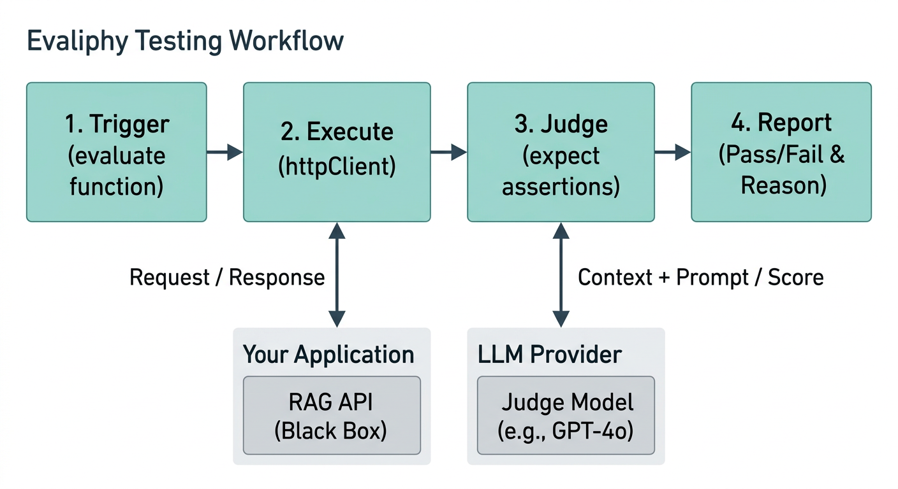

# Evaliphy (Beta)

> **RAG Evaluation, Without the ML Jargon.**

The first QA-centric SDK for testing Retrieval-Augmented Generation. Write end-to-end evaluations for your AI pipelines using the exact same workflow you use for Playwright. No prompt engineering required.

Visit https://evaliphy.com for more details.

[](https://www.npmjs.com/package/evaliphy)
[](https://opensource.org/licenses/MIT)

## Quick Start

```bash
npm install -g evaliphy
npx evaliphy init
```

## If you can write a test, you can evaluate AI.

Stop fighting with Python notebooks, complex ML metrics, and brittle API calls. Evaliphy gives you a fluent, type-safe API to test RAG pipelines as black boxes.

```typescript
import { evaluate, expect } from 'evaliphy';

const sample = {
  query: "What is the return policy?",
  expectedContext: "Items can be returned within 30 days."
};

evaluate("Return Policy Chat", async ({ httpClient }) => {
  // 1. Hit your RAG endpoint (streaming supported natively)
  const res = await httpClient.post('/api/chat', { message: sample.query });
  const data = await res.json();

  // 2. Assert against the LLM's behavior in plain English
  await expect({sample.query, data.answer, sample.expectedContext}).toBeFaithful({threshold:0.8});
  await expect({sample.query, data.answer, sample.expectedContext}).toBeRelevant();
});
```

## Why Evaliphy?
It fits where your tests already live.
- TypeScript-native — eval files sit in your repo alongside your other tests
- Runs in CI like any other test suite
- Produces reports your whole team can read
- You test your real API.

Makes HTTP calls to your actual running service
- Evaluates what comes back — not a notebook, not a dataset loaded in memory
- If your RAG system breaks in production, Evaliphy catches it the same way your E2E tests catch a broken UI
- The judges are built in.

Faithfulness, relevance, groundedness — the assertions that matter are shipped with the framework
- Call expect(response).toBeFaithful() and Evaliphy handles the rest
- No prompt writing, no LLM wiring, no configuration beyond pointing it at your API
- Configurable without being overwhelming.

Sensible defaults out of the box — works without touching the config.
- Override the judge model globally, per eval file, or per individual assertion(to be developed).
- Bring your own prompts if the built-in ones don't fit your domain.
- It speaks QA.

Assertion style will feel familiar if you have used Jest, Vitest, or Playwright
- No new mental model to learn
- You are applying what you already know to AI output instead of UI behaviour


## How it Works



## Join the Beta Program

We are currently in open beta. We’re looking for QA teams and software engineers building RAG applications to help us refine the API and expand our matcher library.

- ✅ Free for commercial use during Beta
- ✅ Influence the v1.0 roadmap

[Star on GitHub](https://github.com/priyanshus/evaliphy) | [Submit Feedback](https://forms.gle/9ztrqUCXUg2YGSJJA)]

## License

MIT © [Evaliphy](https://github.com/priyanshus/evaliphy)
